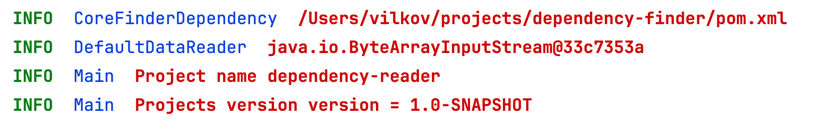

# dependency-finder

Утилита на Java для анализа проектов и извлечения информации о зависимостях из файлов сборки. На текущем этапе поддерживается разбор `pom.xml` (Maven) с извлечением имени и версии проекта.

## Возможности

- Определение типа системы сборки проекта (Maven и др. — через `BuildSystemConstants`)
- Чтение файла сборки в память (`ByteArrayInputStream`)
- SAX-парсинг `pom.xml` с извлечением полей `name` и `version`
- Расширяемая архитектура парсеров через интерфейс `AbstractDataParser`

## Требования

- JDK 26+ (см. `maven.compiler.source` / `maven.compiler.target` в `pom.xml`)
- Maven

## Структура проекта

```
org.faketri
├── core            # константы и общая логика (BuildSystemConstants и т.д.)
├── dto             # модели данных (Project, Version, BuildSystem)
├── logger          # обёртка над логированием (BaseLoggerFactory, Logger)
├── parser          # интерфейс парсеров и реализации (AbstractDataParser)
│   └── impl        # конкретные парсеры (MavenDataParser и т.д.)
└── Main            # точка входа
```

Ключевые классы:

- **`MavenDataParser`** — парсит содержимое `pom.xml` через SAX и собирает `Project` (имя, группа, версия).
- **`DefaultDataReader`** — читает файл проекта в `ByteArrayInputStream` для последующего парсинга.
- **`CoreFinderDependency`** — определяет путь к файлу сборки и запускает анализ.

## Сборка и запуск

```bash
mvn clean package
java -cp target/classes org.faketri.Main
```

## Пример вывода



## Известные ограничения

- Поддержка других систем сборки (Gradle и др.) пока не реализована.

## Планы по развитию

- [ ] Поддержка Gradle (`build.gradle` / `build.gradle.kts`)
- [ ] Извлечение списка зависимостей (`<dependencies>`), а не только метаданных проекта